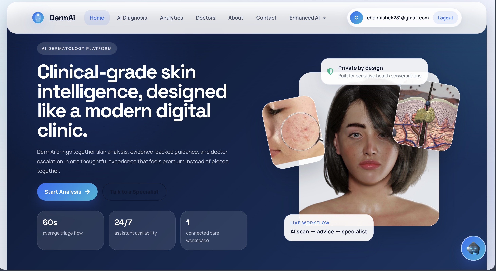
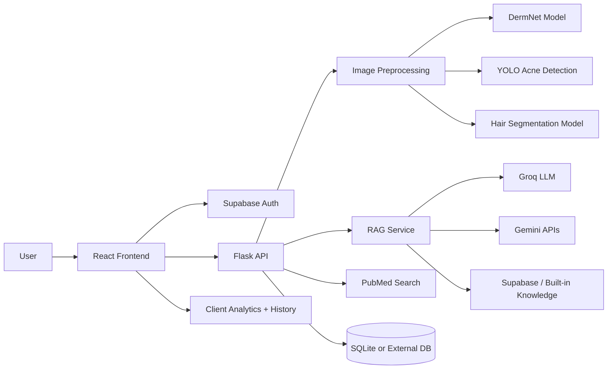

# DermAi

DermAi is a full-stack AI dermatology platform built for rapid skin-health triage, patient education, and intelligent follow-up. It combines a React frontend, a Flask inference API, multiple vision models, RAG-enhanced clinical guidance, optional Supabase-backed authentication, and a production-oriented application architecture.



## Hackathon Submission Summary

### Problem
Skin concerns are often ignored until they worsen, while dermatology access can be expensive, delayed, or geographically limited. Patients need faster triage, clearer education, and a way to track changes over time before they escalate.

### Solution
DermAi delivers:

- image-based skin analysis for general dermatology, acne, and hair-loss workflows
- AI-generated treatment context and follow-up guidance
- a RAG-enhanced dermatology assistant grounded in curated knowledge
- longitudinal analytics for repeat scans and trend visibility
- a doctor-connection path for escalation to human care

### Why this is technically strong

- multimodal inference pipeline across multiple specialized models
- hybrid reasoning stack using deterministic ML + LLM enrichment
- environment-driven configuration across frontend and backend services
- protected routes and optional Supabase authentication
- production-style hardening with CORS allowlists, health checks, upload limits, and Gunicorn

## Judge Quick Walkthrough

If you only have a minute to evaluate the project:

1. Open the landing page and inspect the product shell and navigation.
2. Sign in and upload an image in **AI Diagnosis**.
3. Trigger **Smart Analysis** to see model aggregation and AI-enriched guidance.
4. Open **Enhanced AI** to test RAG-based dermatology Q&A.
5. Visit **Analytics** to review confidence trends and historical result cards.
6. Use **Doctors** as the escalation path from AI triage to human care.

## Core Capabilities

- **AI Image Diagnosis**: Upload a skin image and run condition analysis across dermnet, acne, hair, or smart-routing workflows.
- **Smart Analysis Orchestration**: The backend can evaluate multiple model outputs and aggregate results into a richer report.
- **Enhanced AI Chatbot**: Dermatology Q&A powered by RAG with Groq/Gemini fallback logic.
- **Clinical Knowledge Search**: Search PubMed and surface evidence-linked educational context.
- **Analytics Dashboard**: Review historical scans, confidence trends, and condition summaries.
- **Doctor Escalation Flow**: Move from automated guidance to consult-oriented UX when needed.
- **Graceful Degradation**: Features continue to operate when optional services such as Supabase or local text models are unavailable.

## System Architecture



## Technical Stack

### Frontend

- React 18
- React Router 6
- CRACO
- Chart.js + `react-chartjs-2`
- Framer Motion
- React Dropzone
- Supabase JS client
- Custom CSS design system

### Backend

- Flask
- Flask-JWT-Extended
- Flask-Bcrypt
- Flask-SQLAlchemy
- Flask-CORS
- Gunicorn
- Requests + Pillow + NumPy

### AI / ML / Retrieval

- TensorFlow for skin / segmentation pipelines
- Ultralytics YOLO for acne detection
- Transformers + optional local text models
- Google Gemini for content generation / embeddings fallback
- Groq for fast LLM responses in RAG mode
- Supabase for optional auth and vector-backed knowledge persistence

## How the AI Pipeline Works

1. **Image intake**  
   The frontend uploads a user-selected image to the Flask backend with route-specific metadata.

2. **Task routing**  
   Depending on the selected workflow, DermAi triggers one or more specialized inference endpoints:
   - `/classify-dermnet`
   - `/detect-acne`
   - `/segment-hair`
   - `/api/smart-analysis`

3. **Model inference**  
   The backend preprocesses the image and returns structured outputs such as condition name, confidence, overlays, and intermediate metadata.

4. **AI enrichment**  
   Gemini-backed diagnosis context and symptom-aware guidance can be added through:
   - `/gemini-diagnosis`
   - `/gemini-context`
   - `/symptom-checker`

5. **RAG enhancement**  
   For conversational or expanded reasoning, DermAi uses a retrieval layer that can search stored knowledge and generate a grounded response using Groq with Gemini fallback.

6. **Analytics persistence**  
   Results are surfaced in the dashboard and used to derive trends, confidence patterns, and revisit history.

## Key Engineering Decisions

- **Stable backend runtime conventions**: The backend uses a clear runtime contract with a default port of `7860`.
- **Env-driven configuration**: Secrets, origins, auth providers, and model behavior are controlled via environment variables rather than hardcoded values.
- **Fail-safe startup**: Missing optional services do not fully crash the app; the system falls back where possible.
- **Security-minded defaults**:
  - JWT secret generation fallback for local development
  - configurable upload size limits
  - CORS origin allowlisting
  - protected frontend routes
  - `.env` files excluded from git
- **Operational visibility**: `/health` is available for runtime validation and health monitoring.

## Feature Map

| Area | What it does | Main files |
| --- | --- | --- |
| Home / Product UX | Landing experience, services overview, navigation shell | `src/components/Home.js`, `src/components/Navbar.js`, `src/components/Footer.js` |
| AI Diagnosis | Image upload, model selection, inference UX | `src/components/AIDiagnosis.js`, `backend/app.py` |
| Enhanced AI | RAG chatbot, knowledge workflows | `src/components/EnhancedDermAiChatbot.js`, `src/components/KnowledgeManagement.js`, `backend/rag_service.py` |
| Analytics | History, trends, confidence summaries, modal reports | `src/components/Analytics.js` |
| Auth | Login, signup, optional Supabase integration | `src/contexts/AuthContext.js`, `src/config/supabase.js`, `backend/auth.py` |
| Doctor Connect | Human escalation / consult-oriented interface | `src/components/ConnectDoctor.js`, `src/components/DoctorList.js` |
| Medical Search | PubMed literature search | `src/components/PubMedSearch.js`, `backend/app.py` |

## Repository Structure

```text
DERMA-/
├── backend/
│   ├── app.py
│   ├── auth.py
│   ├── gemini_manager.py
│   ├── rag_service.py
│   ├── extensions.py
│   ├── supabase_auth_middleware.py
│   ├── requirements.txt
│   ├── Dockerfile
│   ├── .env.example
│   └── model assets (.h5 / .pt)
├── public/
├── src/
│   ├── components/
│   ├── contexts/
│   ├── config/
│   ├── services/
│   └── styles/
├── Dockerfile
├── docker-compose.yml
├── craco.config.js
├── .env.example
└── README.md
```

## Environment Configuration

Create two env files:

- root `.env` for React
- `backend/.env` for Flask

Use the included examples as the starting point:

```bash
cp .env.example .env
cp backend/.env.example backend/.env
```

### Frontend environment variables

| Variable | Purpose |
| --- | --- |
| `REACT_APP_BACKEND_URL` | Base URL of the Flask API. |
| `REACT_APP_SUPABASE_URL` | Optional Supabase project URL for frontend auth. |
| `REACT_APP_SUPABASE_ANON_KEY` | Optional Supabase anonymous key. |
| `REACT_APP_EMAILJS_SERVICE_ID` | Contact workflow integration. |
| `REACT_APP_EMAILJS_TEMPLATE_ID` | Contact workflow integration. |
| `REACT_APP_EMAILJS_USER_ID` | Contact workflow integration. |
| `GENERATE_SOURCEMAP` | Usually `false` for leaner builds. |

### Backend environment variables

| Variable | Purpose |
| --- | --- |
| `JWT_SECRET_KEY` | JWT signing secret for auth-protected backend flows. |
| `DATABASE_URL` | External DB connection string. If absent, local SQLite or in-memory fallback is used. |
| `FRONTEND_URL` | Primary frontend origin. |
| `PUBLIC_FRONTEND_URL` | Optional public frontend URL reference. |
| `PUBLIC_BACKEND_URL` | Optional public backend URL reference. |
| `ALLOWED_ORIGINS` | Comma-separated CORS allowlist. |
| `SUPABASE_URL` / `SUPABASE_KEY` | Optional Supabase client config. |
| `SUPABASE_SERVICE_ROLE_KEY` | Optional privileged key for backend workflows. |
| `SUPABASE_ANON_KEY` | Optional anon key for hybrid auth flows. |
| `SUPABASE_JWT_SECRET` | Optional JWT verification secret. |
| `GROQ_API_KEY` | Enables fast RAG LLM responses. |
| `GEMINI_API_KEY` and fallbacks | Enables Gemini-assisted diagnosis/context/embedding flows. |
| `HF_TOKEN` | Required only if enabling optional local text model downloads. |
| `ENABLE_LOCAL_TEXT_MODELS` | `true` to load optional local text generation models. |
| `MAX_UPLOAD_MB` | Upload size guardrail. |
| `FLASK_DEBUG` | `true` only for local debugging. |

## Local Development

### Prerequisites

- Node.js 18+
- npm 9+
- Python 3.11 recommended
- `pip` or `pip3`
- Docker optional

### 1. Clone the repository

```bash
git clone https://github.com/iamabhishek2828/DERMA-.git
cd DERMA-
```

### 2. Install frontend dependencies

```bash
npm install
```

### 3. Install backend dependencies

```bash
cd backend
python3 -m venv .venv
source .venv/bin/activate
pip install -r requirements.txt
cd ..
```

### 4. Configure environment files

```bash
cp .env.example .env
cp backend/.env.example backend/.env
```

For fully local development, set:

```bash
REACT_APP_BACKEND_URL=http://127.0.0.1:7860
```

### 5. Run the backend

```bash
cd backend
python3 app.py
```

The Flask API starts on `http://127.0.0.1:7860`.

### 6. Run the frontend

```bash
npm start
```

The React app starts on `http://127.0.0.1:3000`.

## Docker

### Frontend

```bash
docker build -t dermai-frontend .
docker run -p 3000:80 dermai-frontend
```

### Backend

```bash
cd backend
docker build -t dermai-backend .
docker run -p 7860:7860 --env-file .env dermai-backend
```

### Compose

```bash
docker compose up --build
```

## API Overview

### Health and utility

- `GET /health` - health check
- `GET /` - API landing route
- `GET /pubmed-search?q=eczema` - PubMed query proxy

### Auth

- `POST /auth/signup`
- `POST /auth/login`
- `POST /auth/register-supabase-user`
- `GET /api/verify-token`

### Image inference

- `POST /segment-hair`
- `POST /detect-acne`
- `POST /classify-dermnet`
- `POST /api/smart-analysis`
- `POST /api/predict`
- `POST /upload`

### AI augmentation

- `POST /gemini-diagnosis`
- `POST /gemini-context`
- `POST /symptom-checker`
- `POST /chatbot`
- `GET /diagnosis`

### RAG endpoints

- `POST /api/rag/chat`
- `GET /api/rag/test`
- `POST /api/rag/enhanced-diagnosis`
- `POST /api/rag/store-knowledge`
- `POST /api/rag/search-knowledge`
- `POST /api/rag/seed-knowledge`

## Validation Commands

Run these before shipping:

```bash
npm run build
CI=true npm test -- --watchAll=false
python3 -m compileall backend/app.py backend/auth.py backend/gemini_manager.py backend/rag_service.py backend/extensions.py backend/supabase_auth_middleware.py
```

## Implementation Notes

- secrets are env-driven and excluded from git
- the backend runs with Gunicorn inside Docker
- large local text models are disabled by default
- analytics and history features are resilient even when optional backend services are unavailable

## Known Constraints

- This is a hackathon-grade clinical support product, not a regulated medical device.
- Some ML dependencies can be difficult to install on certain local macOS/Python combinations.
- Supabase-backed features require valid project credentials to be fully enabled.

## Future Roadmap

- longitudinal patient profiles backed by persistent cloud storage
- physician review workflow with appointment booking and case handoff
- richer evidence citations inside the RAG responses
- model monitoring, observability, and inference telemetry
- fine-grained role-based access control for clinicians and admins

## Medical Disclaimer

DermAi is intended for educational support, early triage assistance, and experimentation. It must not be used as a substitute for professional medical diagnosis, emergency care, or treatment by a licensed dermatologist.

## Contact

GitHub: `https://github.com/iamabhishek2828/DERMA-`  
Email: `chabhishek281@gmail.com`
